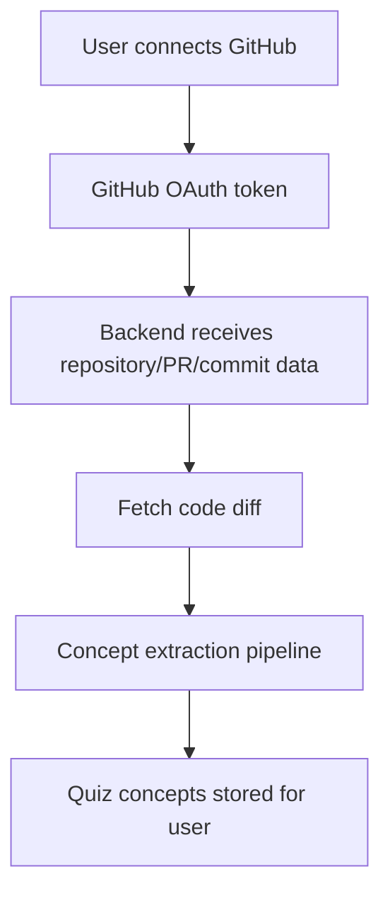
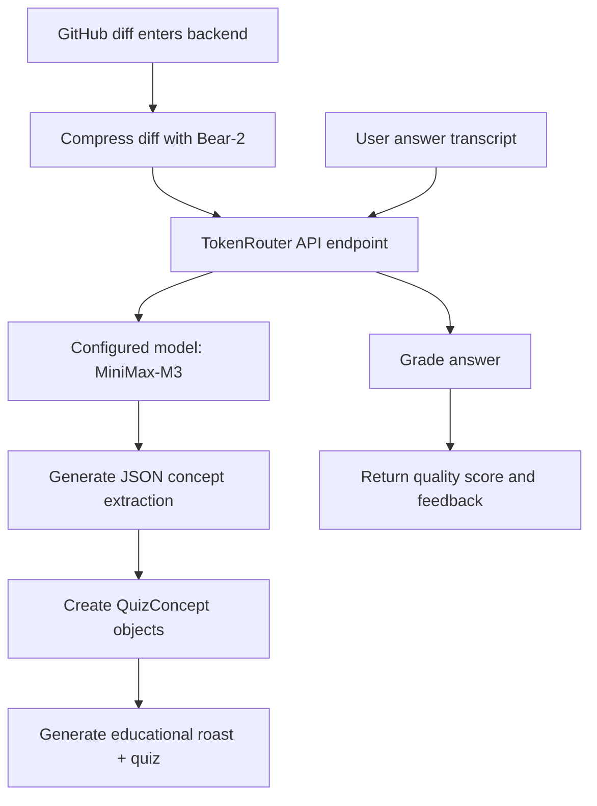
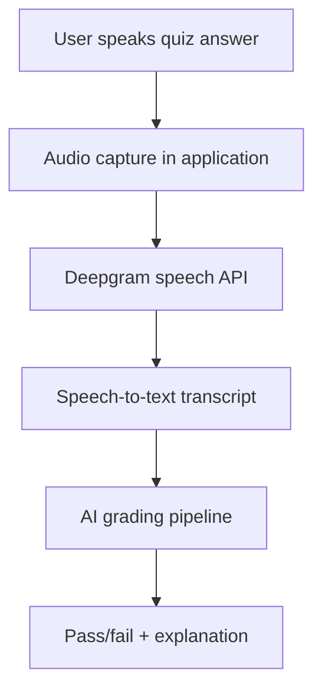
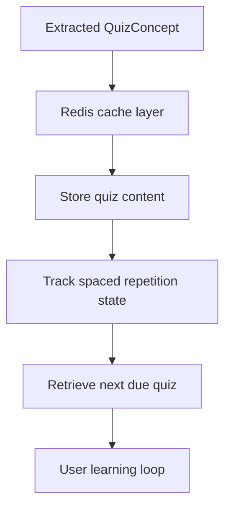
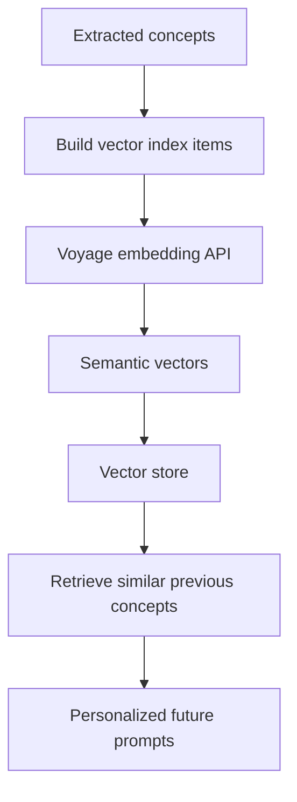
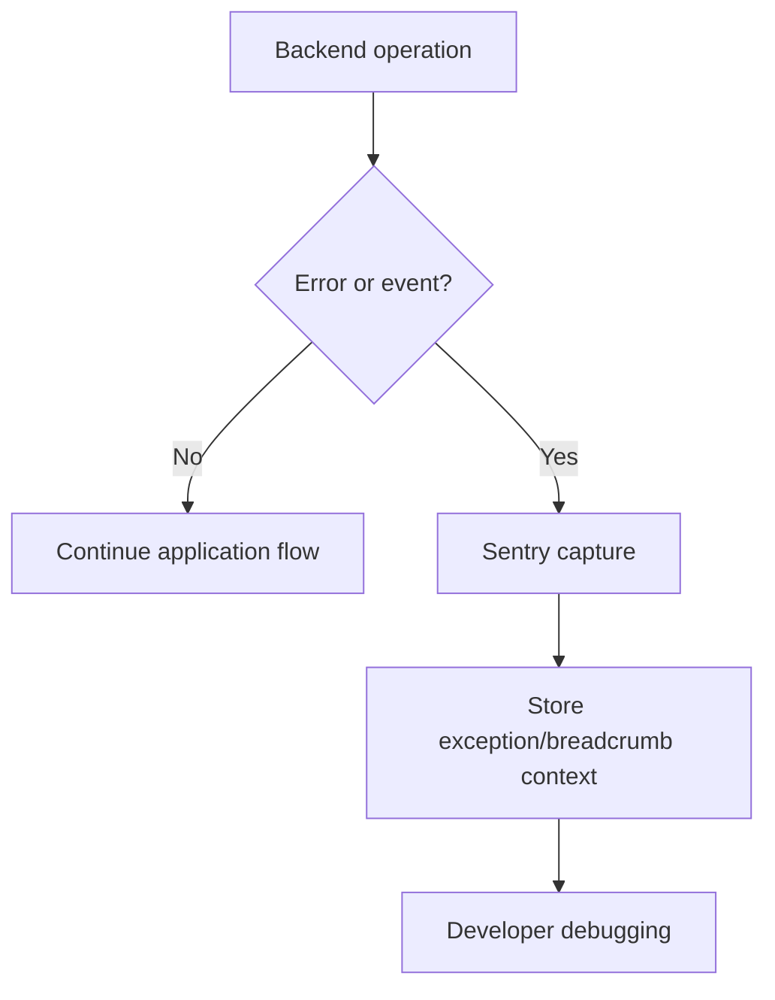
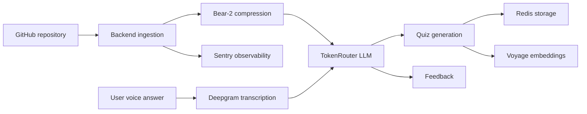

# Sponsor Integration Flowcharts

This document maps how each external sponsor/service is used inside the application.

## GitHub — Source ingestion

## TokenRouter / OpenAI-compatible AI Gateway — LLM processing

## Deepgram — Speech processing

## Redis Cloud — Caching and state storage

## Voyage AI — Vector embeddings / RAG memory

## Sentry — Monitoring and error tracking

## Full application sponsor flow

Sources inspected in repository:
- `backend/services/claude.py` contains the LLM extraction/grading flow, Redis caching, vector indexing, and Sentry instrumentation.
- `backend/config.py` defines external integrations including TokenRouter, Deepgram, Redis, Sentry, Voyage AI, and GitHub configuration.
